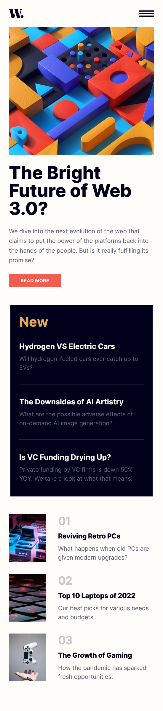
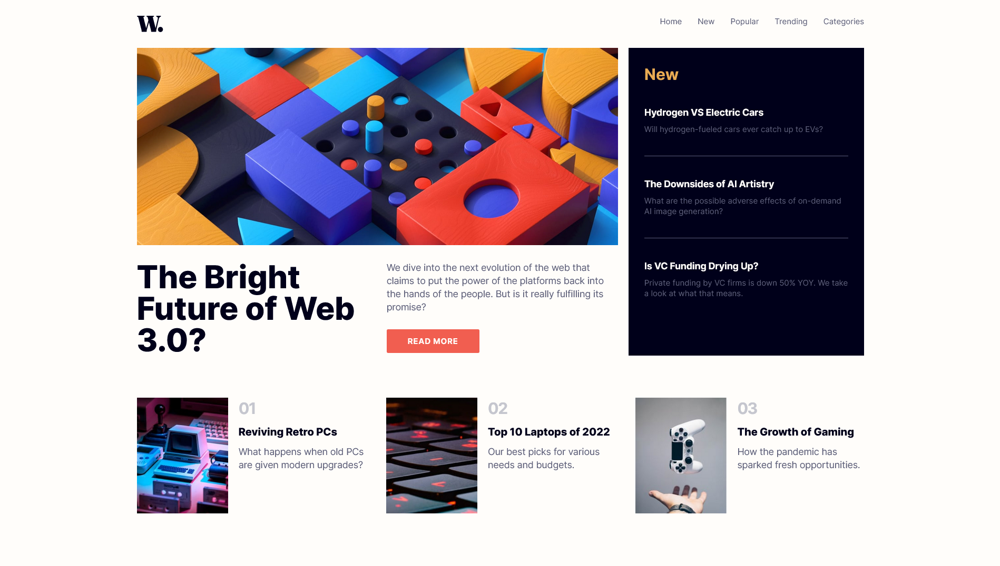

# Frontend Mentor - News homepage solution

This is a solution to the [News homepage challenge on Frontend Mentor](https://www.frontendmentor.io/challenges/news-homepage-H6SWTa1MFl).

### The challenge

Users should be able to:

- View the optimal layout for the interface depending on their device's screen size
- See hover and focus states for all interactive elements on the page
- **Bonus**: Toggle the mobile menu (requires some JavaScript)

### Screenshots
 

*Mobile design*

 

*Desktop design*

## My process

Since, this page/site includes minimal JavaScript code, I decided to use vanilla JS. JS is used for nav options toggling and scroll effects. 

I used *Tailwind CSS* without any preprocessors to style this page. The commit history indicates my process.

### Built with

- Semantic HTML5 markup
- Tailwind CSS
- JavaScript
- Mobile-first workflow

### Links

- Live Site URL: [GitHub Pages](https://kanuos.github.io/news-homepage/)
- Solution URL: [GitHub](https://github.com/kanuos/news-homepage) 

## Author

- Website - [sounakmukherjee](https://www.sounakmukherjee.com)
- Frontend Mentor - [@kanuos](https://www.frontendmentor.io/profile/kanuos)
- Github - [@kanuos](https://www.github.com/kanuos)

